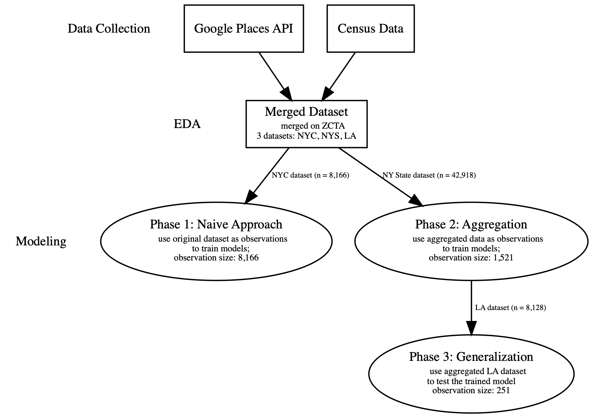

# Using Regression Models to Predict Home Affordability Ratio 

Author: [Freda Xin](https://github.com/FredaXin)

---
## Table of Contents
Please note that the notebooks in the **Data Collection and Initial Data Cleaning** section
are just demonstrations for early stage development; for each notebook there is a corresponding
python script to handle repeated tasks.  
- Data Collection and Initial Data Cleaning
    - [01_data_collection_google_places_API](https://github.com/FredaXin/capstone/blob/master/code/01_data_collection_google_places_API.ipynb)
       | [python script](https://github.com/FredaXin/capstone/blob/master/code/data_collection_google.py)
    - [02_01_initial_data_cleaning_google_phase_1](https://github.com/FredaXin/capstone/blob/master/code/02_01_initial_data_cleaning_google_phase_1.ipynb) | [python script](https://github.com/FredaXin/capstone/blob/master/code/initial_data_cleaning_google_phase_1.py)
    - [02_02_initial_data_cleaning_google_phase_2_3](https://github.com/FredaXin/capstone/blob/master/code/02_02_initial_data_cleaning_google_phase_2_3.ipynb)
      | [python script](https://github.com/FredaXin/capstone/blob/master/code/initial_data_cleaning_google_phase_2_3.py)
    - [03_initial_data_cleaning_income_by_zip](https://github.com/FredaXin/capstone/blob/master/code/03_initial_data_cleaning_income_by_zip.ipynb)
      | [python script](https://github.com/FredaXin/capstone/blob/master/code/initial_data_cleaning_income_by_zip.py)
    
- EDA
    - [04_eda_and_data_cleaning](https://github.com/FredaXin/capstone/blob/master/code/04_eda_and_data_cleaning.ipynb)
      | [python script](https://github.com/FredaXin/capstone/blob/master/code/data_cleaning_phase_2_3.py)
    
- Modeling
    - [05_01_modeling_phase_1_naive_approach](https://github.com/FredaXin/capstone/blob/master/code/05_01_modeling_phase_1_naive_approach.ipynb)
    - [05_02_modeling_phase_2_aggregation](https://github.com/FredaXin/capstone/blob/master/code/05_02_modeling_phase_2_aggregation.ipynb)
    - [05_03_modeling_phase_3_generalization](https://github.com/FredaXin/capstone/blob/master/code/05_03_modeling_phase_3_generalization.ipynb)
---
## Problem Statement:
In regions where rapid new urban development emerges, home prices tend to become
less affordable in the initial phase of the development. This phenomena occurs
in many U.S. regions such as San Francisco, Denver, and NYC, where the
residents' income level could not keep up with the fast increase in home prices.

[Home affordability ratio](https://www.jchs.harvard.edu/home-price-income-ratios) is defined as the **median home price** and **median annual income** ratio. "Historically a house in the US cost around 3 to 4 times the median annual income. During the housing bubble of 2007 the ratio surpassed 5 - in other words, the median price for a single family home in the United States cost more than 5 times the US median annual household income"[(reference)](https://www.longtermtrends.net/home-price-median-annual-income-ratio/). In recent years, many U.S. neighborhoods have become unaffordable for the residents.

In my project, I will explore whether commercial activities in a given
neighborhood can be predictive for home affordability ratios. I will use the [Google Places
API](https://developers.google.com/places/web-service/details) to gather data
about neighborhood businesses, such as types, opening hours, price level etc. To
calculate Home affordability ratio, I will use the Census data from
[incomebyzipcode.com](https://www.incomebyzipcode.com/median-income-by-zip-code-list#order_form).
The aim of the project is to develop a model that can make quick predictions
given the latest commercial activities in a neighborhood. This approach has the
advantage of being up-to-date, comparing to the traditional
method based
on census information. It can also serve as an early indicator and to be used by any
municipality: if certain patterns of business activities emerges, the problem of
a neighborhood becomes unaffordable might fellow.

---
## Executive Summary
I developed **supervised regression models** to predict affordability and
used **R2** score as the metric to measure the performance of the models.

During the data collection process, I encountered many limitations caused by the
Google Places API, such as the limitation on the number of businesses returned per
location and inaccuracy of the string search results. It is also worth noting
that all Census data reply on [ZIP Code Tabulation
Areas
(ZCTAs)](https://www.census.gov/programs-surveys/geography/guidance/geo-areas/zctas.html),
which are different than zipcodes. When making Google API calls, ZCTAs were
used instead of zipcodes. 

During the EDA process, I found that the distribution of the target home
affordability ratios is right-skewed. This confirmed the common knowledge: some
areas in New York City (and New York State) are extremely unaffordable. I also
discovered that most features do not have a linear relationship with the target;
this might indicate that models that rely on linear regression may not perform
well. When analyzing the correlation between the features and the target, I
found that the feature 'open_now' was the top 1 feature that is positively
correlated with the target. I further analyzed the pros and
cons of using this feature in training the models. 

The modeling process is divided into 3 phases: 

**Phase 1**: the Naive Approach  
The so-called “Naive Approach” is based on a simple idea: we want to 
be able to use ALL the original observations to train the models. 

Motivated by this idea, I engineered aggregated features based on each zipcode, and
concatenated them back to the original data-frame.

In theory, the benefit of this
approach is twofold:
- We would be able to capture the general information of each zipcode.
- We would be able to retain the same amount of data as the original dataset.
  This will ensure that we have sufficient amount data to train the models.

**Phase 2**: Aggregation  
I used the aggregated observations by zipcode, combining with census data from the Income dataset to train the models.

I used the the pattern sub-model technique to handle missing data. This enabled
us to handle the missing data without imputation or dropping observations.

6 types of models were trained: Linear Regression (combined with various
regularization techniques), Polynomial Regression, KNN, Tree based models, SVR, and
Stochastic Gradient Descent. Each model was fitted with two datasets based on
the pattern defined by the sub-model method. 

**Phase 3**: Generalization  
In this phase, none of the features from the Census data were used to train the models. The model was trained with New York State data. 

To test the transferability of the model, the LA dataset will be used on the
trained model to make predictions. 

The general workflow of this project is shown in the following flowchart. 

---
## Workflow 

---
## Conclusion 
### Phase 1: the Naive Approach
I discovered that the naive approach led to data leakage issue, and therefore invalid. However, this does NOT mean that in general we can't use aggregated features along with the original dataset; we just can't aggregated the observations the SAME way that we aggregated the target.

### Phase 2: Aggregation
In Phase 2, I used the aggregated observations by zipcode, combining with census
data from the Income dataset to train the model.

The pattern sub-model enabled us to handle missing data without imputation or dropping observations.
Among all the regression models, the `BaggingRegressor` yields the best result
based on the test R2 score. However, even the best model still shows signs of
high variance, and the result is not optional.

Based on the model evaluation, features from the census data play an
importance role in the model's performance. This finding posed challenges
to my goal of developing a generalization of the model: i.e. Using the model to
predict home affordability ratio in other U.S. regions without retraining the
model.

### Phase 3: Generalization
Without the census data, the performance of the model decreased. Training only with the Google Places API data, the `LinearRegression` Model combined with L1 Regularization outperformed the others. 

Using the trained `LinearRegression` Model to make predictions for the LA
dataset, the model performed badly. Based on the test scores, as well as the
residuals plots, we can conclude that the model trained on the New York State
dataset is inadequate for the predication of home affordability ratios in LA, and that the trained model is not transferable. 

This outcome makes intuitive sense: New York State and LA have very different
commercial landscapes and demographics(such as median home
prices and median annual income). The model that has been fitted and trained on the
former is not able to capture the patterns of the latter. 

---
## Limitation and Next Steps
### Next Steps
**Step 1**: Improve data quality: 
- Collect more data: during the early modeling process, I observed that the
  models' performance drastically improved after being trained with more data
  points (from only using NYC to NYS). Since the amount of observations (n =
  1521), I will try to collect more data to improve the model's performance.
- Sampling data from different regions in the U.S, and stratify the samples: In order to help the model learn a wider range of dataset, I will try to randomly sample zipcodes across the States.
- If step 1 has been accomplished, and there is no significant improvement in the model's ability of making predictions, I will do the following:

**Step 2**: Reevaluate the assumptions: 
 - Research on what factors have been proven to be related to home affordability ratio:
   the first and foremost assumption of this project is that commercial
   activities can be predictive for home affordability ratio. This assumption is
   very likely to be unsound. During this project, I have confirmed that
   including census data will increase the model performance; in other words,
   the commercial activity information collected from the Google Places API
   alone are not as predictive as combing with census data. There might be many
   factors that link to home affordability ratio, and further research need to be conducted.
   
 ### Limitations
Using **Google Place API** has many limitations in the data collection process: 

- When using string search, the results returned are unpredictable: e.g. when making an API call using param "stores near zipcode 10010", some unexpected result was returned, such as a school or an government office. 
- The API only returns up to 3 calls per location (each location only returns up to 20 results). This limits the amount of samples can be collect per location. 
- The API returns 20 results per call, and it's unclear what algorithms was behind these results: such as proximities to the location centroid or popularity of the business as search result. So the businesses returned by the calls might be biased based on Google's algorithms.
- As mentioned in notebook 04, the 'open_now' feature is dependent on the time when the API calls are made. 
- The Google Place API is not free: making many API calls will make the project very expensive. Therefore, the amount of data that can be collected can be very limited based on the budget of the project. 

---
## References 
- [Home Price-to-Income Ratios](https://www.jchs.harvard.edu/home-price-income-ratios) by Joint Center for Housing Studies of Harvard University
- [Home Price to Income
  Ratio](https://www.longtermtrends.net/home-price-median-annual-income-ratio/)
  by longtermtrends.net
- [The Impact Of Commercial Development On Surrounding Residential Property
  Values](https://www.gamls.com/images/jonwiley.pdf) by Jonathan A. Wiley, Ph.D.
- [Predicting Neighborhoods’ Socioeconomic Attributes Using Restaurant
  Data](https://www.pnas.org/content/116/31/15447) by Lei Dong, Carlo Ratti, and
  Siqi Zheng
- [Big Data and Big Cities: The Promises and Limitations of Improved Measures of
  Urban Life](https://www.nber.org/papers/w21778) by Edward L. Glaeser, Scott Duke Kominers, Michael Luca, Nikhil Naik 